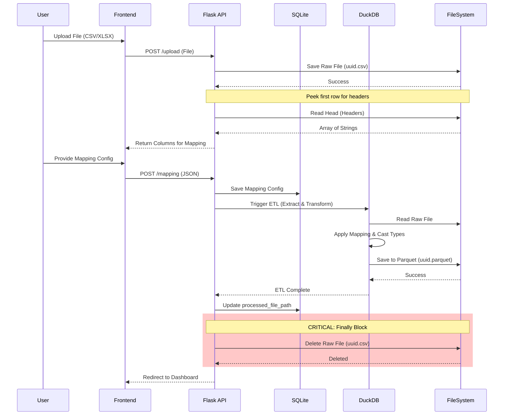
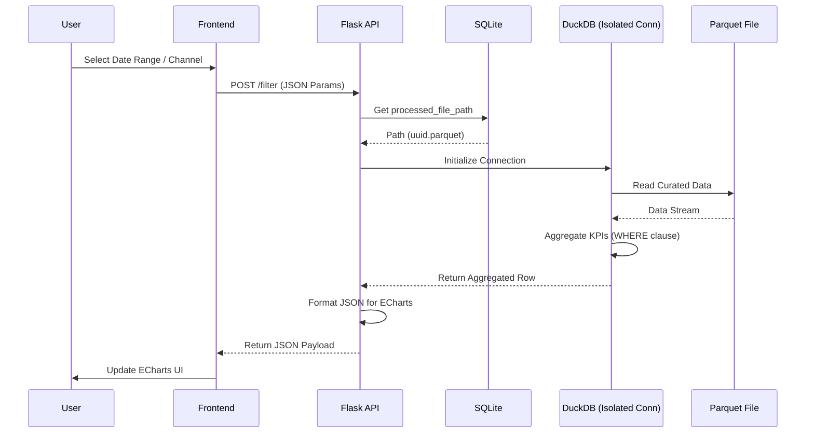
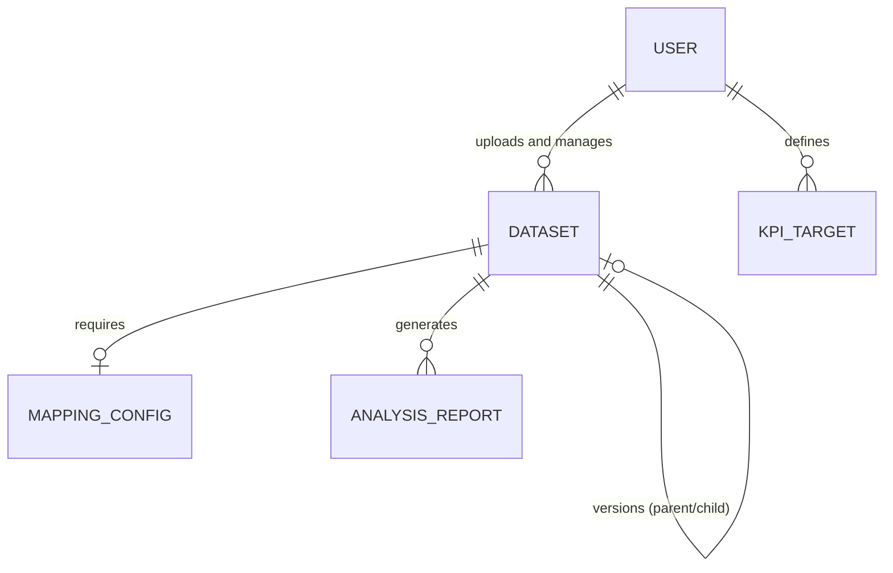
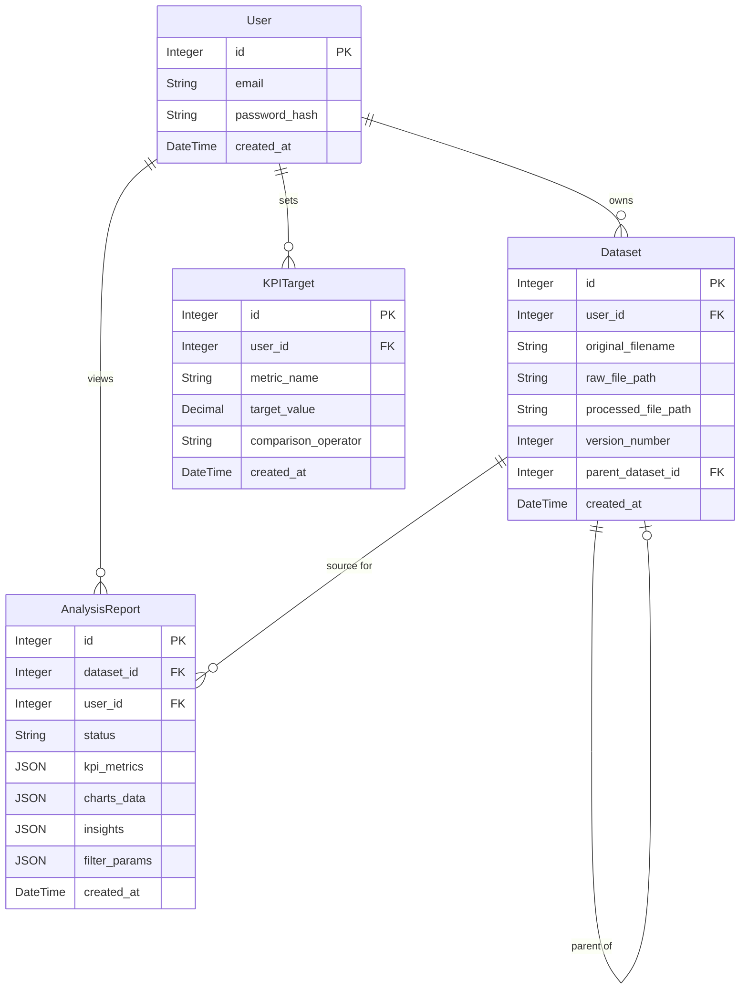

# ADA.BI | System Architecture Portfolio

This repository contains the technical documentation, architectural design, and API contracts for **ADA.BI**. I built this pet project to showcase my skills as a System Analyst. If you are a hiring manager, this repository demonstrates how I approach business problems, design system architectures, and write clear specifications for developers.

You can view the full business context, user requirements, and UI designs in my main portfolio hub:
**[View the Full ADA.BI Case Study on Notion](https://grand-bathroom-927.notion.site/ADA-BI-34e059ef362d80b1aa70c48c449b965e)**


## What is ADA.BI?

Small businesses often struggle to track their marketing performance. Their data is scattered across different CSV exports(like Google Ads or Meta Ads), and they usually cannot afford expensive analytics tools like Tableau. 

ADA.BI is a lightweight analytical platform designed to solve this. A business owner can simply upload a raw data file, visually map their columns, and instantly get a dashboard showing complex unit economics like CAC and LTV. It requires zero coding or SQL knowledge from the user.

## How the Architecture Works

To make the platform fast, cheap to host, and easy to maintain, I designed a specific architectural flow that avoids heavy, traditional database clusters. Here is how the system handles data:

1. **Ingestion & Temporary Storage:** When a user uploads a CSV or Excel file, the Flask backend saves it temporarily to the local disk.
2. **In-Memory Processing (DuckDB):** Instead of loading the data into a standard database, the system uses DuckDB. DuckDB reads the file and performs all the ETL (Extract, Transform, Load) operations entirely in memory. It cleans the data, applies the user's column mapping, and casts data types (like ensuring money is handled precisely).
3. **Columnar Storage (Apache Parquet):** Once the data is clean, DuckDB saves it as an Apache Parquet file. Parquet is highly compressed and optimized for analytical queries. Immediately after this, the original raw file is deleted to prevent memory leaks and save server space.
4. **Metadata Management (SQLite):** While the actual analytics data lives in Parquet files, we still need to track users, sessions, and dataset statuses. I chose SQLite for this. It handles user authentication and stores the paths to the Parquet files.
5. **Dynamic Frontend Analytics:** When a user applies a date filter on the dashboard, the backend opens an isolated connection to the specific Parquet file, runs the calculation, and returns a small, formatted JSON payload. The frontend uses Vanilla JS and Apache ECharts to render the graphs without doing any heavy lifting.


## System Architecture Visualizations

### 1. Data Pipeline (ETL) Sequence
This diagram shows the step-by-step flow from the moment the user uploads a file to the moment the clean Parquet file is saved. Notice the critical block at the end that ensures the raw file is always deleted.



### 2. Dynamic Filtering Sequence
This diagram illustrates what happens when a user interacts with the dashboard. The system recalculates metrics directly from the Parquet file using an isolated connection, which is extremely fast and prevents data mixing between users.




## Database Design

### Phase 1: Conceptual Data Model
Purpose: Define business entities and their high-level relationships without technical implementation details.



### Phase 2: Logical Data Model
Purpose: Define the data structure, attributes, and keys independent of the specific DBMS.



### Phase 3: Physical Data Model
Purpose: Implementation-specific schema for SQLite and Apache Parquet.

```dbml
Table users {
  id INTEGER [pk, increment]
  email TEXT [unique, not null]
  password_hash TEXT [not null]
  created_at TIMESTAMP [default: `CURRENT_TIMESTAMP`]
}

Table datasets {
  id INTEGER [pk, increment]
  user_id INTEGER [not null, ref: > users.id]
  original_filename TEXT [not null]
  raw_file_path TEXT
  processed_file_path TEXT
  mapping_config TEXT // JSON payload
  version INTEGER [default: 1]
  parent_dataset_id INTEGER [ref: > datasets.id]
  created_at TIMESTAMP [default: `CURRENT_TIMESTAMP`]
}

Table analyses {
  id INTEGER [pk, increment]
  dataset_id INTEGER [not null, ref: > datasets.id]
  user_id INTEGER [not null, ref: > users.id]
  status TEXT [default: 'processing'] // processing, completed, failed
  kpi_metrics TEXT // JSON payload
  charts_data TEXT // JSON payload
  insights TEXT // JSON payload
  filter_params TEXT // JSON payload
  created_at TIMESTAMP [default: `CURRENT_TIMESTAMP`]
}

Table kpi_targets {
  id INTEGER [pk, increment]
  user_id INTEGER [not null, ref: > users.id]
  metric_name TEXT [not null]
  target_value REAL [not null]
  comparison TEXT [not null] // 'lte', 'gte'
  created_at TIMESTAMP [default: `CURRENT_TIMESTAMP`]
}
```


## Business Metrics (KPIs)

The system automatically calculates 8 unit economics metrics. The backend runs these formulas in-memory so the frontend just has to display the numbers.

| KPI | Name | Formula | Purpose |
| :--- | :--- | :--- | :--- |
| **ROMI** | Return on Marketing Investment | `((Revenue - Spend) / Spend) * 100` | Measures profitability of marketing spend. |
| **DRR** | Share of Ad Expenses | `(Spend / Revenue) * 100` | Shows what percentage of revenue is consumed by ads. |
| **CAC** | Customer Acquisition Cost | `Spend / New Orders` | Cost to acquire one new customer. |
| **CPO** | Cost Per Order | `Spend / Total Orders` | Average marketing cost per order. |
| **CR** | Conversion Rate | `(Total Orders / Traffic) * 100` | Traffic-to-Order efficiency. |
| **Retention** | Retention Rate | `(Returning Orders / Total Orders) * 100` | Share of repeat customers. |
| **LTV** | Simplified Period LTV | `Revenue / New Orders` | Average revenue generated per acquired customer. |
| **LTV:CAC** | LTV to CAC Ratio | `LTV / CAC` | An indicator of overall business health. |


## Frontend Visualizations

The REST API serves pre-formatted JSON structures directly to the frontend. The UI uses ECharts to draw the data. We planned three core charts for the dashboard:

1. **Revenue vs Orders (Line Chart):** A chart with two Y-axes to show how sales volume correlates with income over time.
2. **Spend by Channel (Horizontal Bar Chart):** Shows where the marketing budget is going. Using horizontal bars keeps long channel names readable.
3. **New vs Returning Customers (Donut Chart):** A clean visualization of customer retention.


## Repository Files

If you want to look at the exact code and contracts, you can find them in these folders:

* `specs/openapi.yaml`: The complete OpenAPI 3.0 specification. This defines all endpoints, required data, error codes, and JSON schemas.
* `db/schema.dbml`: The database architecture file.
* `frontend/charts.html`: A working HTML file containing the ECharts code to show how the JSON data is visualized on the frontend.

---
+ Designed and Documented by Nikita Adagamov as a System Analysis Portfolio Project
