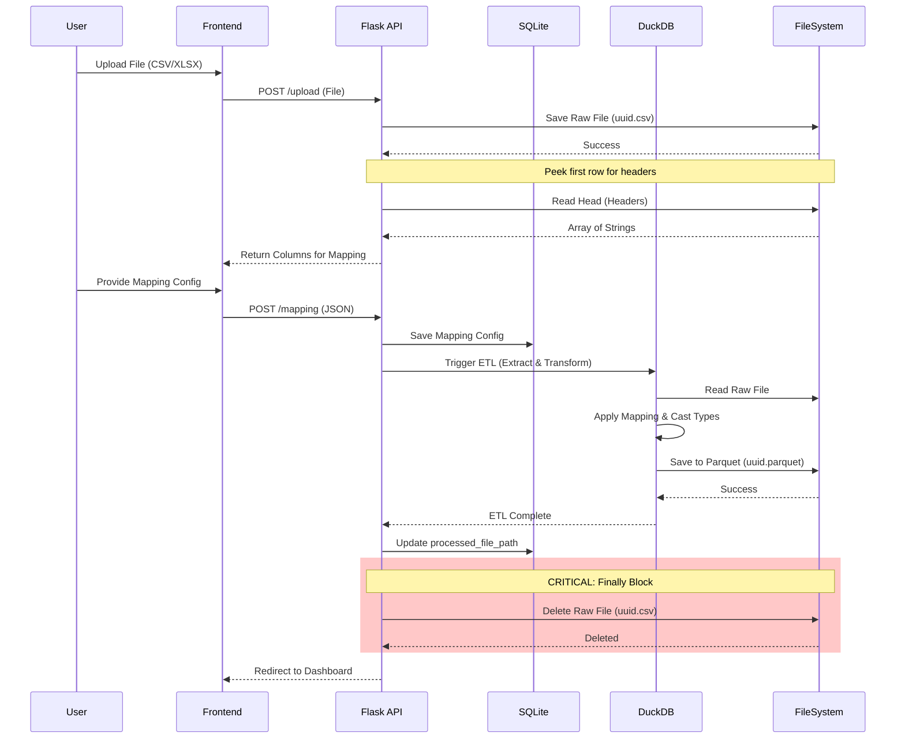
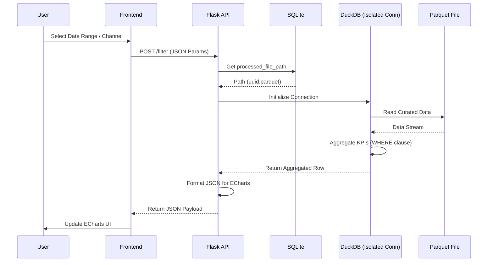

# ADA.BI | Analytical Platform System Architecture

**ADA.BI** is a lightweight, high-performance analytical BI platform designed specifically for small businesses to track unit economics and marketing performance. It processes raw data files entirely in-memory using **DuckDB** and persists curated datasets in **Apache Parquet**.

🔗 **[Full Project Case Study & Architecture Docs (Notion Hub)](#вставь_сюда_ссылку_на_твой_Notion)**

## Repository Contents
This repository contains the technical artifacts derived from the System Analysis and Architecture design phases:
* `specs/openapi.yaml` - The complete OpenAPI 3.0 REST contract.
* `db/schema.dbml` - Physical database schema (SQLite + Parquet layout).
* `frontend/charts.html` - ECharts reference configurations for the Dark Glassmorphism UI.

## Tech Stack
* **Data Processing:** DuckDB, Apache Parquet
* **Backend:** Python (Flask)
* **Database:** SQLite (Metadata)
* **Frontend:** Vanilla JS, ECharts, CSS Grid
* **Documentation:** OpenAPI 3.0, DBML, Mermaid.js

---

## Architecture Visualizations

### 1. Data Pipeline (ETL) Sequence
The automated flow from a raw CSV upload to an isolated DuckDB transformation, resulting in a persistent Parquet file.

### 2. Dynamic Filtering Sequence
Demonstrates how the system instantly recalculates metrics by reading directly from the Parquet file using isolated connections, bypassing full ETL overhead.

